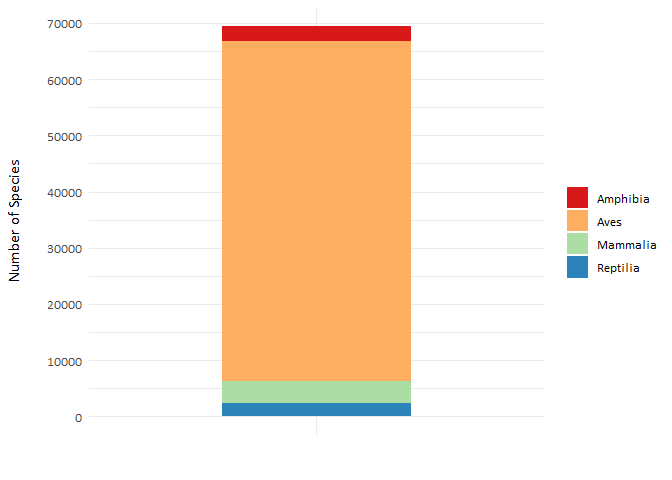
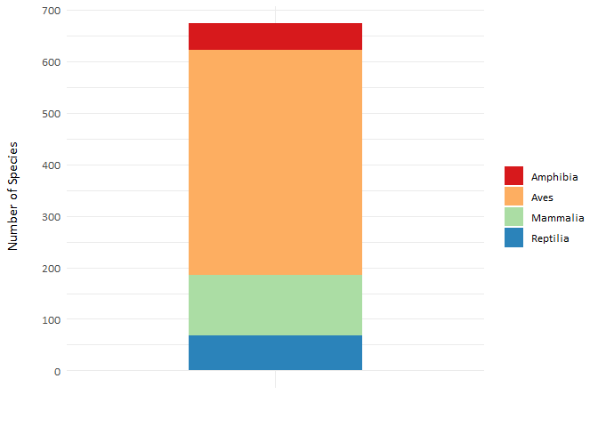
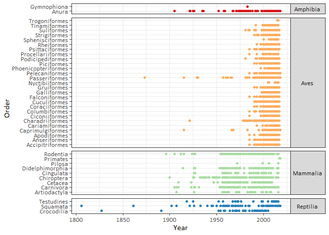
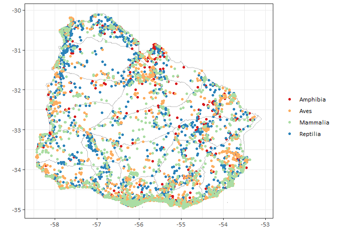

The following scripts were used to generate the figures of the Data Paper [**“Biodiversidata: An Open-Access Biodiversity Database for Uruguay”**](https://doi.org/10.3897/BDJ.7.e36226), published in the **Biodiversity Data Journal**. 

The dataset **Biodiversidata\_1.0.0** provides primary biodiversity data on extant Amphibia, Reptilia, Aves and Mammalia species recorded within the country area of Uruguay. This is the largest and most geographically and taxonomically comprehensive database of Uruguayan tetrapod species available to date, and it represents the first open repository of the country.

You can find the data here

------------------------------------------------------------------------

Enough talking! Let's explore the data!
---------------------------------------

To run this code you will need the following R packages:

    library(tidyverse)
    library(extrafont)
    library(dismo)

We will see the data's:  
1. [Taxonomic coverage](#1-taxonomic-coverage)  
2. [Temporal coverage](#2-temporal-coverage)  
3. [Geographic coverage](#3-geographic-coverage)

Let's start by getting the database. We could read the file like this:

    Biodiversidata <- read_csv('Biodiversidata_1.0.0.csv')

But we are going to include all the column names and types to avoid having any reading errors on our file.

    Biodiversidata <- read_csv('Biodiversidata_1.0.0.csv', 
                                 col_types = cols(occurrenceID = col_character(),
                                                  scientificName = col_character(),
                                                  scientificNameAuthorship = col_character(),
                                                  vernacularName = col_character(),
                                                  kingdom = col_character(),
                                                  phylum = col_character(),
                                                  class = col_character(),
                                                  order = col_character(),
                                                  family = col_character(),
                                                  genus = col_character(),
                                                  specificEpithet = col_character(),
                                                  infraspecificEpithet = col_character(),
                                                  countryCode = col_character(),
                                                  stateProvince = col_character(),
                                                  verbatimLocality = col_character(),
                                                  decimalLatitude = col_number(),
                                                  decimalLongitude = col_number(),
                                                  georeferenceSources = col_character(),
                                                  georeferencedBy = col_character(),
                                                  eventDate = col_date(format = ""),
                                                  year = col_number(),
                                                  month = col_number(),
                                                  day = col_number(),
                                                  basisOfRecord = col_character(),
                                                  institutionCode = col_character(),
                                                  collectionCode = col_character(),
                                                  catalogNumber = col_character(),
                                                  recordedBy = col_character(),
                                                  recordNumber = col_character(),
                                                  identifiedBy = col_character(),
                                                  dynamicProperties = col_character(),
                                                  associatedReferences  = col_character()))

------------------------------------------------------------------------

Now that we are ready! Let's explore the data.

### What's the total amount of records in the database?

    Biodiversidata %>% nrow()

    ## [1] 69380

### What's the total amount of species in the database?

    Biodiversidata %>% distinct(scientificName) %>% nrow()

    ## [1] 673

## 1) Taxonomic coverage  

The database includes records representing 129 families, 446 genera and 673 species: 51 amphibians, 68 reptiles, 437 birds, and 117 mammals.

### What's the number of records per class?

    Biodiversidata %>% 
      group_by(class) %>% 
      count()  

    ## # A tibble: 4 x 2
    ## # Groups:   class [4]
    ##   class        n
    ##   <chr>    <int>
    ## 1 Amphibia  2530
    ## 2 Aves     60627
    ## 3 Mammalia  3915
    ## 4 Reptilia  2308

### Let's plot this

    Biodiversidata %>% 
      group_by(class) %>% 
      count() %>% 
      ggplot(aes(x='', y=n, fill=class)) +
      geom_bar(width = 0.5, stat = "identity") +
      labs(x='', y= 'Number of Species', fill = '') +
      theme_minimal() +
      scale_y_continuous(breaks = seq(0, 70000,10000)) +
      scale_fill_brewer(palette ='Spectral')+
      theme(text=element_text(family='Calibri', size = 12)) +
      theme(axis.title.y = element_text(margin = margin(t = 0, r = 20, b = 0, l = 0)))

### What's the number of species per class?

    Biodiversidata %>% 
      distinct(scientificName, class) %>% 
      group_by(class) %>% 
      count() 

    ## # A tibble: 4 x 2
    ## # Groups:   class [4]
    ##   class        n
    ##   <chr>    <int>
    ## 1 Amphibia    51
    ## 2 Aves       437
    ## 3 Mammalia   117
    ## 4 Reptilia    68

### and the plot?

    Biodiversidata %>% 
      distinct(scientificName, class) %>% 
      group_by(class) %>% 
      count() %>% 
      ggplot(aes(x='', y=n, fill=class)) +
      geom_bar(width = 0.5, stat = "identity") +
      labs(x='', y= 'Number of Species', fill = '') +
      theme_minimal() +
      scale_y_continuous(breaks = seq(0, 1000, 100)) +
      scale_fill_brewer(palette ='Spectral')+
      theme(text=element_text(family='Calibri', size = 12)) +
      theme(axis.title.y = element_text(margin = margin(t = 0, r = 20, b = 0, l = 0)))

The taxonomic coverage is uneven!

## 2) Temporal coverage  

The records included in Biodiversidata cover samples reported in Uruguay during the period of 1806–2018. How are these records distributed over time within the groups?

    ggplot(Biodiversidata, aes(x=year, y=order, color=class)) +
      geom_point(show.legend = FALSE) +
      scale_colour_brewer(palette ='Spectral')+
      facet_grid(class~., scales = "free", space= 'free_y', switch='x' ,drop=TRUE) +
      theme_bw() +
      theme(text=element_text(family='Calibri', size=12)) +
      theme(strip.text.y = element_text(size=10, angle=0)) +
      labs(x='Year', y='Order', color = '') 

    ## Warning: Removed 5597 rows containing missing values (geom_point).

## 3) Geographic coverage  

To finish let's map the records. First, we are going to download
Uruguay's shapefile data from [GADM](http://gadm.org/) using the ISO
country code 'UY' and the level 1 for administrative boundaries.

    Uruguay <- getData("GADM", country="UY", level=1)

Now we map the occurrence records separated by class.

    ggplot() + 
      geom_polygon(data=Uruguay, aes(long,lat,group=group), fill="white") +
      geom_path(data=Uruguay, aes(long,lat, group=group), color="grey", size=0.1) +
      geom_point(data = Biodiversidata, aes(x=decimalLongitude, y = decimalLatitude, color = factor(class))) +
      scale_color_brewer(palette ='Spectral') +
      labs(x='', y= '', color = '') +
      theme_bw() +
      theme(text=element_text(family='Calibri', size = 12))

And that's all !
----------------

------------------------------------------------------------------------

**If you use the data please cite as:**  
Grattarola F, Botto G, da Rosa I, Gobel N, González E, González J, Hernández D, Laufer G, Maneyro R, Martínez-Lanfranco J, Naya D, Rodales A, Ziegler L, Pincheira-Donoso D (2019) Biodiversidata: An Open-Access Biodiversity Database for Uruguay. Biodiversity Data Journal 7: e36226. https://doi.org/10.3897/BDJ.7.e36226
