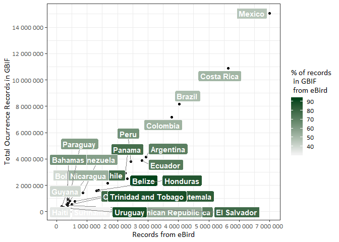

# GBIF data in Latin America

In our recent [Data Paper](https://doi.org/10.3897/BDJ.7.e36226), we
showed that Uruguay ranks amongst the countries of Latin America with
the lowest levels of available data on their biodiversity in the Global
Biodiversity Information Facility [GBIF](https://www.gbif.org/). Also,
that most of the records that we found in GBIF belong to the
[eBird](https://ebird.org/home) initiative, the world’s largest
biodiversity-related citizen science project. The extensive contribution
provided by eBird to GBIF highlights the enormous role that data
provided by citizens play in the development of global biodiversity
datasets, while at the same time, points out the critical taxonomical
biases encountered in GBIF for the region.

Here is the code to build the data table from scratch using the
[rgbif](https://ropensci.org/tutorials/rgbif_tutorial/) package to
retrieve data from GBIF. **Let's start!** To run this code, you will need
the following R packages:

    library(rgbif)
    library(ggrepel)
    library(extrafont)
    library(tidyverse)

Latin America
-------------

First, we create a list of Latin American countries and codes, and a
variable for the eBird dataset key. Find the ISO CODES of countries
[here](https://countrycode.org/).

    LatinAmerica <- data.frame(country= c('Mexico', 'Brazil', 'Costa Rica', 'Colombia', 'Peru', 'Argentina', 'Ecuador', 'Panama', 'Chile', 'Venezuela', 'Belize', 'Honduras', 'Bolivia', 'Guatemala', 'Cuba', 'Nicaragua', 'Paraguay', 'Bahamas', 'Jamaica', 'Trinidad and Tobago', 'Guyana', 'Dominican Republic', 'El Salvador', 'Suriname', 'Uruguay', 'Haití'), code=c('MX', 'BR', 'CR', 'CO', 'PE', 'AR', 'EC', 'PA', 'CL', 'VE', 'BZ', 'HN', 'BO', 'GT', 'CU', 'NI', 'PY', 'BS', 'JM', 'TT', 'GY', 'DO', 'SV', 'SR', 'UY', 'HT'))

    eBirdKey <- '4fa7b334-ce0d-4e88-aaae-2e0c138d049e'

If you wanted to search other dataset sources and don't know the key
value, you could check the function `datasets()` and return a list of
datasets matching the query search

    datasets(data='all', query='eBird')

Function
--------

Next, we declare the function, that takes a list of countries and codes,
and returns for each country the count of the **total number of
occurrence records** and the number of those that belong to **eBird**.

    count_country_records <- function(List){
      CountryList <- data.frame(country = character(),
                                code = character(),
                                numberOfRecords = numeric(),
                                eBirdRecords = numeric(), stringsAsFactors=FALSE)
      for (code in List$code){
        numberOfRecords_country <- occ_count(country=code, georeferenced=TRUE)
        numberOfRecords_country_eBird <- occ_count(country=code, datasetKey= eBirdKey, georeferenced=TRUE) 
        CountryList_country <- data.frame(country = List[List$code==code,1],
                                          code = code,
                                          numberOfRecords = numberOfRecords_country,
                                          eBirdRecords = numberOfRecords_country_eBird, stringsAsFactors=FALSE)
        CountryList <- rbind(CountryList, CountryList_country)
      }
      return(CountryList)
    }

Now we run the function to create the data

    LatinAmerica <- count_country_records(LatinAmerica)

    ##                country code numberOfRecords eBirdRecords
    ## 1               Mexico   MX        15043237      6992473
    ## 2               Brazil   BR         8169257      4023507
    ## 3           Costa Rica   CR        10890424      5634356
    ## 4             Colombia   CO         7166734      3776681
    ## 5                 Peru   PE         3798876      2442519
    ## 6            Argentina   AR         4148032      2940847
    ## 7              Ecuador   EC         3867735      2806824
    ## 8               Panama   PA         2932335      2261739
    ## 9                Chile   CL         2152025      1676229
    ## 10           Venezuela   VE         1445854       859298
    ## 11              Belize   BZ         2491648      2318225
    ## 12            Honduras   HN         1603648      1375775
    ## 13             Bolivia   BO          944213       375645
    ## 14           Guatemala   GT         1579952      1318613
    ## 15                Cuba   CU          779373       606691
    ## 16           Nicaragua   NI          807919       432861
    ## 17            Paraguay   PY          650151       390653
    ## 18             Bahamas   BS          533186       341283
    ## 19             Jamaica   JM          333306       241219
    ## 20 Trinidad and Tobago   TT          566399       500421
    ## 21              Guyana   GY          404496       161875
    ## 22  Dominican Republic   DO          322126       179115
    ## 23         El Salvador   SV          472999       371781
    ## 24            Suriname   SR          175728        55151
    ## 25             Uruguay   UY          286433       253805
    ## 26               Haití   HT          110039        38016

Plot
----

We will plot the distribution of the number of occurrence records
available GBIF (as for the date of the query) for each country of Latin
America, relative to the number of records that have been submitted by
eBird users. The respective proportion will be shown in the green scale.

    ggplot(LatinAmerica, aes(eBirdRecords, numberOfRecords, label = country)) +
      geom_point(aes(fill= eBirdRecords*100/numberOfRecords)) +
      geom_label_repel(aes(fill = (eBirdRecords*100/numberOfRecords)), 
                       colour = "white", fontface = "bold", segment.color = 'grey50') +
      labs(y='Total Ocurrence Records in GBIF', 
           x='Records from eBird', 
           fill='% of records\n in GBIF\n from eBird') +
      scale_fill_gradient(low = "#f2f2f2", high ="#00441b") +
      scale_y_continuous(breaks = seq(0, 18000000,2000000), labels = scales::number) +
      scale_x_continuous(breaks = seq(0, 7000000,1000000), labels = scales::number) +
      theme_bw() +
      theme(text=element_text(family='Calibri', size=12))

Maybe you should zoom in to see the details :)

And that's all !
----------------

**Check our Data Paper for more info:**

Grattarola F, Botto G, da Rosa I, Gobel N, González E, González J,
Hernández D, Laufer G, Maneyro R, Martínez-Lanfranco J, Naya D, Rodales
A, Ziegler L, Pincheira-Donoso D (2019) Biodiversidata: An Open-Access
Biodiversity Database for Uruguay. Biodiversity Data Journal 7: e36226.
<https://doi.org/10.3897/BDJ.7.e36226>
