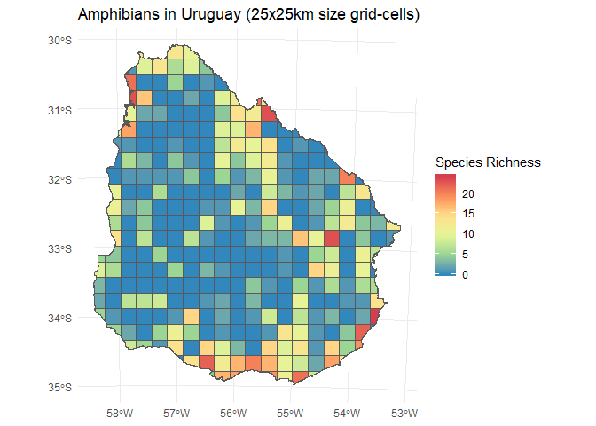
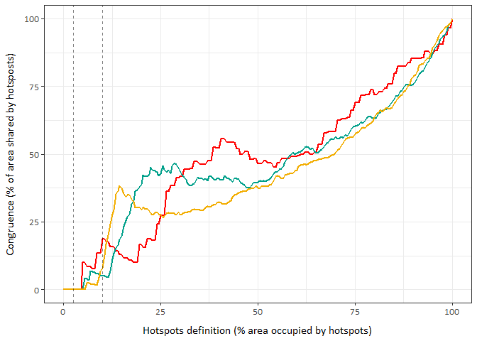
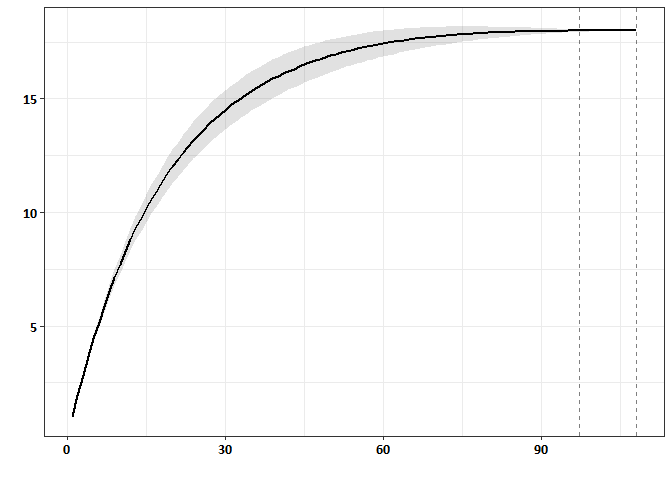
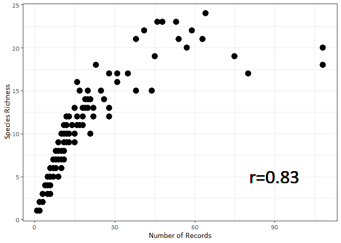

The following scripts were used for the analyses of the paper with the running title **“Multiple measures of vertebrate biodiversity hotspots: lesson from Uruguay”**. We will use the data for amphibians as an example.

Analyses
--------

1.  [Hotspots congruence](#1-hotspots-congruence)  
2.  [Identification of ‘areas of ignorance’](#2-areas-of-ignorance)
3.  [Spatial correlations](#3-spatial-correlations)

To run this code you will need the following R packages:

    library(vegan)
    library(spaa)
    library(wesanderson)
    library(extrafont)
    library(lctools)
    library(SpatialPack)
    library(tidyverse)

1) Hotspots congruence
----------------------

We analysed the congruence between hotspots of:

-   **SR**: Species Richnes (Number of Species)
-   **E**: Endemism (Range-size-weighted Species Richness) - Roll, et al. (2017)
-   **T**: Threat (Threatened Species Proportion with Global IUCN categories) - Böhm, et al. (2013)

To analyse the extent of congruence between the biodiversity hotspots we varied both the **size of the sampling unit** (size of the grid-cell in km) and the **criterion to define a hotspots** (% of area/number of cells occupied by hotspots). The level of congruence was then addressed by calculating the number of overlapping grid-cells according to the varying definition criterion.

### Function

The function `get_sharedArea` sorts the grid-cells from high to low values of the hotspots (species richnes, endemism and threned species proportion) and at each definition criterion (from 0 to 100% by 0,5%), computes the percentage of congruence as the number of matching grid-cells over the total number of unique cells. The congruence percentage will be calculated as $matching-grid-cells \* 100 \\over total-number-of-unique-cells$

    get_sharedArea<- function(dataset){
      sharedArea <- data.frame(gridPercentage = double(),
                               congruencePercentage= double(),
                               stringsAsFactors=FALSE)
      
      dataset <- dataset %>% filter(NR!=0)
      hotspotAreaDefinition <- (nrow(dataset)*seq(0,100,0.5))/100
      
      for(i in hotspotAreaDefinition) {
        GridID_SR <- dataset %>% 
          arrange(desc(SR)) %>% 
          head(i) %>% 
          select(GridID)
        GridID_E <- dataset %>% 
          arrange(desc(E)) %>% 
          head(i) %>% 
          select(GridID)
        GridID_TP <- dataset %>% 
          arrange(desc(TP)) %>% 
          head(i) %>% 
          select(GridID)
        
        cumulativeGrids <- nrow(unique(bind_rows(GridID_SR, 
                                                 GridID_E,
                                                 GridID_TP)))
        
        grid_sharedArea <- data.frame(gridPercentage = (i*100)/nrow(dataset),
                                      congruencePercentage= ifelse(floor(i)!=0, 
                                                                   ((nrow(Reduce(intersect, 
                                                                                 list(GridID_SR, 
                                                                                      GridID_E,
                                                                                      GridID_TP))))*100)/
                                                                     cumulativeGrids, 0), stringsAsFactors=FALSE)
        sharedArea <- rbind(sharedArea, grid_sharedArea)
      }
      return(sharedArea)
    }

### Working example

We will calculate the spatial congruence of hotspots of amphibians in Uruguay, using data mapped at three different grid-cell sizes: 12.5x12.5km, 25x25km and 50x50km.

    Amphibia_50.GRIDs <- read_csv('Amphibia_UY50_OK.csv')
    Amphibia_25.GRIDs <- read_csv('Amphibia_UY25_OK.csv') 
    Amphibia_125.GRIDs <- read_csv('Amphibia_UY125_OK.csv') 

Each table has 5 columns: An ID for each grid-cell (**GridID**), the number of records or sampling effort per grid-cell (**NR**), and the values of hotspots of Species Richness (**SR**), Endemism (**E**) and Threat (**TP**) for each grid. For instance, the data at 50x50km scale looks like this:

    ## # A tibble: 93 x 5
    ##    GridID    NR    SR     E     TP
    ##     <dbl> <dbl> <dbl> <dbl>  <dbl>
    ##  1      1     6     4 0.107 0     
    ##  2      2   188    19 7.24  0.0526
    ##  3      3    45    19 1.46  0.0526
    ##  4      4    71    23 2.87  0.0435
    ##  5      5    10     8 0.266 0     
    ##  6      6    15    11 0.442 0     
    ##  7      7    20    14 0.941 0.0714
    ##  8      8   105    24 3.82  0.0417
    ##  9      9    75    20 2.10  0     
    ## 10     10   132    23 5.41  0.0870
    ## # ... with 83 more rows

Now we run the function `get_sharedArea` for each grid-cell size dataset

    Amphibia_50_sharedArea <- get_sharedArea(Amphibia_50.GRIDs)
    Amphibia_25_sharedArea <- get_sharedArea(Amphibia_25.GRIDs)
    Amphibia_125_sharedArea <- get_sharedArea(Amphibia_125.GRIDs)

And to finish, we plot

    pal <- wes_palette(n=3, name='Darjeeling1')
    ggplot(Amphibia_50_sharedArea, aes(gridPercentage, congruencePercentage)) +
      geom_line(color=pal[1], size=1) +
      geom_line(data=Amphibia_25_sharedArea, aes(gridPercentage, congruencePercentage), color=pal[2], size=1) +
      geom_line(data=Amphibia_125_sharedArea, aes(gridPercentage, congruencePercentage), color=pal[3], size=1) +
      geom_vline(xintercept=2.5, linetype="dashed", color = "black",  alpha = .5) +
      geom_vline(xintercept=10, linetype="dashed", color = "black",  alpha = .5) +
      labs(x='Hotspots definition (% area occupied by hotspots)', y= 'Congruence (% of area shared by hotsposts)') +
      theme_bw() +
      theme(legend.position = c(0.06, 0.75))+
      theme(text=element_text(family='Calibri', size = 12)) +
      guides(colour = "colorbar", size = "legend", shape = "legend") +
      theme(axis.title.y = element_text(margin = margin(t = 0, r = 10, b = 0, l = 0)),
            axis.title.x = element_text(margin = margin(t = 10, r = 0, b = 0, l = 0))) 

> Extent of congruence between species richness hotspots, endemic richness hotspots and threat richness hotspots, for amphibian. Relationship between the criterion used to define hotspots and congruence for the three different grid-cells size 50x50km (red line), 25x25km (green line) and 12.5x12.5km (yellow line). Criteria are based on the percentage of land covered by hotspots. Congruence is the number of cells that are hotspots for all three diversity indices, as a percentage of the total hotspot area. Vertical dashed line shows 2.5% and 10% hotspot criterion.

------------------------------------------------------------------------

 

2) Areas of ignorance
---------------------

To identify the areas of ignorance we quantified the levels of inventory incompleteness for each group by using curvilinearity of smoothed species accumulation curves (SACs). This method assumes that SACs of poorly sampled grids tend towards a straight line, while those of better sampled ones have a higher degree of curvature. As a proxy for inventory incompleteness we calculated the degree of curvilinearity as the mean slope of the last 10% of SACs.

### Function

The function `get_gridsSlopes` finds a species accumulation curve (SAC) for each grid-cell using the method ‘exact’ of the function `specaccum` of the vegan package and then calculates the degree of curvilinearity as the mean slope of the last 10% of the curve. We considered grids with slope values > 0.05 as under-sampled and those with slope values ≤ 0.05 as well sampled.

    get_gridsSlopes <- function(data_abundance){
      GridSlope <- data.frame(Grid=integer(), Slope=numeric(), stringsAsFactors=FALSE)
      data_abundance <- as.data.frame(data_abundance) 
      data_abundance$abundance <- as.integer(1)
      cells <- unique(data_abundance$GridID)
      splistT <- list()
      spaccum <- list()
      slope <- list()
      for (i in cells) {
        splist <- data_abundance[data_abundance$GridID == i,c(2:4)]
        splistT[[i]] = data2mat(splist) 
        spaccum[[i]] = specaccum(splistT[[i]], method = "exact")
        slope[[i]] = (spaccum[[i]][[4]][length(spaccum[[i]][[4]])]-
                        spaccum[[i]][[4]][ceiling(length(spaccum[[i]][[4]])*0.9)])/
          (length(spaccum[[i]][[4]])-
             ceiling(length(spaccum[[i]][[4]])*0.9))
        GridSlope_i <- data.frame(Grid=i, Slope=slope[[i]], stringsAsFactors=FALSE)
        GridSlope <- rbind(GridSlope, GridSlope_i)
      }  
      return(GridSlope)
    }

### Working example

Let's calculate the SACs using the data of Amphibia of Uruguay, for the grid-cell size of 25x25km. To run the function we need to have a list of  grid-cells, sample numbers and species. This is, a list of species recorded for each grid-cell.

    Amphibia_25.species <- read_csv('Amphibia_UY25_species.csv') 

    Amphibia_25.SACs <- Amphibia_25.species %>% 
      mutate(Species=str_split(SpeciesList, ';')) %>% 
      unnest() %>% 
      group_by(SpeciesList) %>% mutate(Sample = row_number()) %>% 
      ungroup() %>% 
      mutate(Sample=ifelse(is.na(Species), 0 , Sample)) %>% 
      select(GridID, Sample, Species)

The data looks like this:

    ## # A tibble: 2,663 x 3
    ##    GridID Sample Species              
    ##     <dbl>  <dbl> <chr>                
    ##  1      1      1 Rhinella dorbignyi   
    ##  2      1      2 Boana pulchella      
    ##  3      1      3 Leptodactylus latrans
    ##  4      1      4 Leptodactylus latrans
    ##  5      1      5 Scinax granulatus    
    ##  6      1      6 Boana pulchella      
    ##  7      2      1 Rhinella arenarum    
    ##  8      2      2 Rhinella arenarum    
    ##  9      2      3 Rhinella arenarum    
    ## 10      2      4 Rhinella arenarum    
    ## # ... with 2,653 more rows

Now we run the function `get_gridsSlopes` for the data at 25x25 resolution scale

    Amphibia_25.incompleteness <- get_gridsSlopes(Amphibia_25.SACs)

Let's check which grid-cells are well sampled and plot the accumulation curve

    Grid_wellsampled <- Amphibia_25.incompleteness %>% 
      filter(Slope<=0.05) %>% filter(Slope == min(Slope)) %>% pull(Grid)

    ##   Grid        Slope
    ## 1    3 0.0003026348

To plot the SAC of the well sampled grid-cell we extract the data for that grid-cell and run the SAC for the subset.

    Amphibia_25.wellsampled <- Amphibia_25.SACs %>% 
      filter(GridID==Grid_wellsampled) %>% 
      mutate(abundance=as.integer(1), Observation = 1:n()) %>% 
      select(Observation, Species, abundance)

    Amphibia_25.specaccum <- data2mat(as.data.frame(Amphibia_25.wellsampled)) 
    Amphibia_25.specaccum <- specaccum(Amphibia_25.specaccum, method = "exact")

    Amphibia_25.specaccum_plot <- tibble(sites=Amphibia_25.specaccum$sites, 
                                       richness=Amphibia_25.specaccum$richness,
                                       sd=Amphibia_25.specaccum$sd)

    ggplot(Amphibia_25.specaccum_plot, aes(x=sites, y=richness)) +
      geom_ribbon(aes(ymin=richness-sd, ymax=richness+sd), alpha =0.15) +
      geom_line(linetype=1, size=1) +
      geom_vline(aes(xintercept=max(sites)), linetype=2, color = "black",  alpha = .5) +
      geom_vline(aes(xintercept=0.9*max(sites)), linetype=2, color = "black",  alpha = .5) +
      theme_bw() +
      theme(axis.text=element_text(color='black', size=11, face='bold'),
            text=element_text(family='Calibri')) +
      labs(x='', y= '')

> Plot of the species accumulation curve (SAC) of the well sampled grid-cell for reptilians of Uruguay using the 25 × 25 km grid-cell resolution. Slope value &lt;=0.05 was calculated given the degree of curvilinearity as the mean slope of the last 10% of the curve (shown between dashed vertical lines).

------------------------------------------------------------------------

 

3) Spatial correlations
-----------------------

To measure the association between the number of records (**NR**) and the species-richness patterns (**SR**) per grid-cell, we need to test each variable for spatial autocorrelation using Moran’s I and then, if the are autocorrelated, conduct spatially corrected correlations.

### Working example

First we need the spatial data (coordinates) of the grid-cells. Next step is to filter cells without records (to remove double zeros). Finally, we test autocorrelation for each of the variables, number of records and species-richness.

    Amphibia_25.nonzero <- Amphibia_25.GRIDs %>% 
      bind_cols(., read_csv('Grid_UY_25_XY.csv')) %>%  
      filter(NR !=0)
    XY <- Amphibia_25.nonzero %>% select(X, Y)
    Amphibia_25.autocorrelation.NR <- moransI(XY, Bandwidth=6, Amphibia_25.nonzero$NR)
    Amphibia_25.autocorrelation.SR <- moransI(XY, Bandwidth=6, Amphibia_25.nonzero$SR)

A positive, statistically significant value, indicates a positive spatial autocorrelation

    ## # A tibble: 2 x 5
    ##   Variable Morans.I Expected.I     z   pvalue
    ##   <chr>       <dbl>      <dbl> <dbl>    <dbl>
    ## 1 NR          0.247   -0.00505  6.49 8.55e-11
    ## 2 SR          0.259   -0.00505  6.81 1.00e-11

Given we found positive autocorrelation for our data, the correlations need to be conducted using a corrected Pearson’s correlation for spatial autocorrelation, correcting the degrees of freedom of the analyses

    modified.ttest(Amphibia_25.nonzero$NR, Amphibia_25.nonzero$SR, XY, nclass = 10)

    ## 
    ## Corrected Pearson's correlation for spatial autocorrelation
    ## 
    ## data: x and y ; coordinates: X and Y 
    ## F-statistic: 204.4555 on 1 and 92.3961 DF, p-value: 0 
    ## alternative hypothesis: true autocorrelation is not equal to 0
    ## sample correlation: 0.8299

Now let's plot both variables

    ggplot(Amphibia_25.nonzero, aes(x=NR, y=SR)) + 
      geom_point(size=4) +
      theme_bw() +
      theme(text=element_text(family='Calibri', size=12)) +
      labs(x='Number of Records', y= 'Species Richness') +
      geom_text(x=90, y=5, label="r=0.83", family='Calibri',  size=10)

> Relationship between sampling effort (number of records per grid-cell) and the species-richnes for amphibians, showing the spatial correlation coefficient r. 

 

#### For more information contact [Florencia Grattarola](mailto:flograttarola@gmail.com)  
