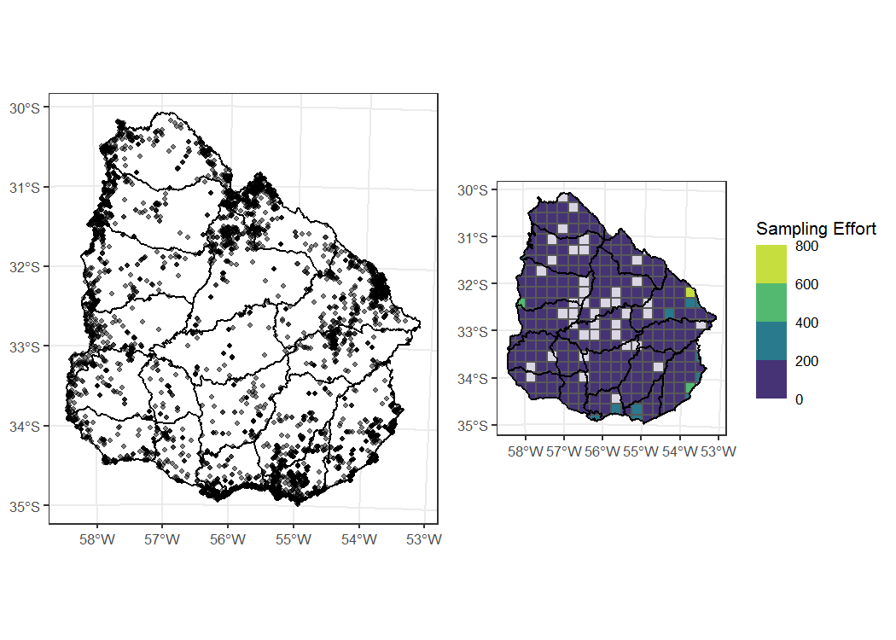

The following scripts were used to generate the analyses and figures of
the Data Paper “Biodiversidata: A novel dataset for the vascular plant
species diversity in Uruguay”, subitted to the Biodiversity Data
Journal.

The dataset **Biodiversidata\_Plants\_1.0.0** provides primary
biodiversity data on extant vascular plant (native and introduced)
species recorded within the country area of Uruguay. This is
[Biodiversidata](http://biodiversidata.org)'s second open-access set of
data on the biodiversity of the country.

You can find the data here 

------------------------------------------------------------------------

We will see the data's:

1.  [Taxonomic coverage](#taxonomic-coverage)  
2.  [Temporal coverage](#temporal-coverage)  
3.  [Geographic coverage](#geographic-coverage)

To run this code you will need the following R packages:

    library(extrafont)
    library(lubridate)
    library(gridExtra)
    library(ggpubr)
    library(sf)
    library(tidyverse)

------------------------------------------------------------------------

First, let's explore the data!
------------------------------

Let's start by reading the data from the database. Once you have
downloaded the dataset, the data will look like this (a tibble with
**12,470** rows and **61** columns):

    Biodiversidata_Plants

    ## # A tibble: 12,470 x 61
    ##    license occurrenceID basisOfRecord recordedBy establishmentMe~
    ##    <chr>   <chr>        <chr>         <chr>      <chr>           
    ##  1 https:~ Biodiversid~ HumanObserva~ Andrés Go~ introducida     
    ##  2 https:~ Biodiversid~ HumanObserva~ Andrés Go~ nativa          
    ##  3 https:~ Biodiversid~ HumanObserva~ Andrés Go~ nativa          
    ##  4 https:~ Biodiversid~ HumanObserva~ Andrés Go~ nativa          
    ##  5 https:~ Biodiversid~ HumanObserva~ Andrés Go~ nativa          
    ##  6 https:~ Biodiversid~ HumanObserva~ Andrés Go~ nativa          
    ##  7 https:~ Biodiversid~ HumanObserva~ Andrés Go~ nativa          
    ##  8 https:~ Biodiversid~ HumanObserva~ Andrés Go~ nativa          
    ##  9 https:~ Biodiversid~ HumanObserva~ Andrés Go~ nativa          
    ## 10 https:~ Biodiversid~ HumanObserva~ Andrés Go~ nativa          
    ## # ... with 12,460 more rows, and 56 more variables:
    ## #   previousIdentifications <chr>, eventDate <chr>, year <dbl>, month <dbl>,
    ## #   day <dbl>, higherGeography <chr>, continent <chr>, country <chr>,
    ## #   countryCode <chr>, stateProvince <chr>, locality <chr>,
    ## #   decimalLatitude <dbl>, decimalLongitude <dbl>, geodeticDatum <chr>,
    ## #   coordinateUncertaintyInMeters <dbl>, coordinatePrecision <dbl>,
    ## #   georeferencedBy <chr>, identifiedBy <chr>, taxonID <chr>,
    ## #   scientificName <chr>, nameAccordingTo <chr>, higherClassification <chr>,
    ## #   kingdom <chr>, phylum <chr>, class <chr>, order <chr>, family <chr>,
    ## #   species <chr>, genus <chr>, specificEpithet <chr>,
    ## #   infraspecificEpithet <chr>, taxonRank <chr>,
    ## #   scientificNameAuthorship <chr>, institutionCode <chr>,
    ## #   collectionCode <chr>, catalogNumber <chr>, recordNumber <chr>,
    ## #   associatedReferences <chr>, verbatimLocality <chr>,
    ## #   georeferenceRemarks <chr>, vernacularName <chr>, locationAccordingTo <chr>,
    ## #   georeferencedDate <date>, georeferenceSources <chr>,
    ## #   georeferenceVerificationStatus <chr>, organismRemarks <chr>,
    ## #   verbatimLatitude <chr>, verbatimLongitude <chr>,
    ## #   verbatimCoordinateSystem <chr>, locationRemarks <chr>,
    ## #   measurementType <chr>, measurementValue <chr>,
    ## #   measurementDeterminedBy <chr>, measurementRemarks <chr>, language <chr>,
    ## #   otherCatalogNumbers <chr>

### What's the total amount of records and species in the database?

To get sumarised data out of our database, such as the total number of
species or the total number of records with date of collection, we use
the function `summarise` together with `n_distinct`. We can `group_by`
any column we want, for example, by the taxonomic **class** of each
record or by any specific **group**. To get the **Total** values, we can
also summarise without grouping the data.

    Biodiversidata_Plants %>%
      mutate(group=ifelse(class=='Magnoliopsida'|class=='Liliopsida', 'Angiosperms',
                                ifelse(class=='Gnetopsida'|class=='Pinopsida', 'Gymnosperms',
                                       ifelse(class=='Polypodiopsida', 'Ferns', 
                                              'Lycophytes')))) %>% 
      group_by(group) %>% # use this or comment depending on the output you want
      summarise(N= n(), # total number of records
                S= n_distinct(species), # number of species
                wDate= sum(!(is.na(year))), # records that have a year of collection
                last30y = sum(year>1990, na.rm = T), # records that were collected in the last 30 years
                wCoordinates= sum(!(is.na(decimalLatitude))))  # records that have a decimal latitude 

Here's a table that summarises all the data, binding the information
extracted for the groupped data and for the total data. To produce the
table we are using `knitr::kable`.

<table>
<thead>
<tr class="header">
<th align="right">Group</th>
<th align="right">Number of Occurrence Records</th>
<th align="right">Number of Species</th>
<th align="right">Records with Date (%)</th>
<th align="right">Records from the last 30 years (%)</th>
<th align="right">Records with Coordinates (%)</th>
</tr>
</thead>
<tbody>
<tr class="odd">
<td align="right">Lycophytes</td>
<td align="right">13</td>
<td align="right">6</td>
<td align="right">13 (100)</td>
<td align="right">11 (84.6)</td>
<td align="right">13 (100)</td>
</tr>
<tr class="even">
<td align="right">Ferns</td>
<td align="right">540</td>
<td align="right">78</td>
<td align="right">540 (100)</td>
<td align="right">508 (94.1)</td>
<td align="right">540 (100)</td>
</tr>
<tr class="odd">
<td align="right">Gymnosperms</td>
<td align="right">48</td>
<td align="right">5</td>
<td align="right">41 (85.4)</td>
<td align="right">39 (81.2)</td>
<td align="right">48 (100)</td>
</tr>
<tr class="even">
<td align="right">Angiosperms</td>
<td align="right">11869</td>
<td align="right">1559</td>
<td align="right">10527 (88.7)</td>
<td align="right">9585 (80.8)</td>
<td align="right">11869 (100)</td>
</tr>
<tr class="odd">
<td align="right">Total</td>
<td align="right">12470</td>
<td align="right">1648</td>
<td align="right">11121 (89.2)</td>
<td align="right">10143 (81.3)</td>
<td align="right">12470 (100)</td>
</tr>
</tbody>
</table>

### General overview

To get other useful information to fill the metadata section, we will
also summarise fields such as:

    knitr::kable(Biodiversidata_Plants %>% 
      unite('species', genus, specificEpithet, na.rm = TRUE, sep = ' ', remove = FALSE) %>% 
      mutate(places=str_c(decimalLatitude, decimalLongitude)) %>% # unique point locations
      summarise(recordsT= n(),
                speciesN= n_distinct(species),
                familyN= n_distinct(family),
                genusN= n_distinct(genus),
                placesN= n_distinct(places),
                StartDate=min(eventDate, na.rm = T),
                EndDate=max(eventDate, na.rm = T),
                North=max(decimalLatitude),
                South=min(decimalLatitude),
                East=max(decimalLongitude),
                West=min(decimalLongitude),
                departamentos=n_distinct(stateProvince)) %>% 
      rename('Occurrence Records'=recordsT, 'Number of Species'=speciesN, 
             'Families'=familyN, 'Genera'=genusN,
             'Localities (lat/lon)'=placesN, 'Start Date'=StartDate,
             'End Date'=EndDate, 'States (Departamentos)'=departamentos),  align = 'r')

<table>
<thead>
<tr class="header">
<th align="right">Occurrence Records</th>
<th align="right">Number of Species</th>
<th align="right">Families</th>
<th align="right">Genera</th>
<th align="right">Localities (lat/lon)</th>
<th align="right">Start Date</th>
<th align="right">End Date</th>
<th align="right">North</th>
<th align="right">South</th>
<th align="right">East</th>
<th align="right">West</th>
<th align="right">States (Departamentos)</th>
</tr>
</thead>
<tbody>
<tr class="odd">
<td align="right">12470</td>
<td align="right">1648</td>
<td align="right">160</td>
<td align="right">760</td>
<td align="right">4567</td>
<td align="right">1877-02</td>
<td align="right">2020-05-21</td>
<td align="right">-30.17587</td>
<td align="right">-34.9751</td>
<td align="right">-53.2636</td>
<td align="right">-58.43</td>
<td align="right">19</td>
</tr>
</tbody>
</table>

1) Taxonomic coverage
---------------------

The database includes 12,470 records from 160 families and 760 genera,
representing 1,648 species: with 6 species of the Lycopodiopsida class
(**Lycophytes**), 48 of Gnetopsida and Pinopsida classes
(**Gymnosperms**), 78 of the Polypodiopsida class (**Ferns**), and 1,145
of the Magnoliopsida and Liliopsida classes (**Angiosperms**). Also, the
database includes 1,379 native species and 270 introduced, you can see
that in the column **establishmentMeans**.

### What's the number of records/species/families per group?

<table>
<thead>
<tr class="header">
<th align="right">Group</th>
<th align="right">Records</th>
<th align="right">Species</th>
<th align="right">Families</th>
</tr>
</thead>
<tbody>
<tr class="odd">
<td align="right">Lycophytes</td>
<td align="right">13</td>
<td align="right">6</td>
<td align="right">2</td>
</tr>
<tr class="even">
<td align="right">Ferns</td>
<td align="right">540</td>
<td align="right">78</td>
<td align="right">15</td>
</tr>
<tr class="odd">
<td align="right">Gymnosperms</td>
<td align="right">48</td>
<td align="right">5</td>
<td align="right">4</td>
</tr>
<tr class="even">
<td align="right">Angiosperms</td>
<td align="right">11869</td>
<td align="right">1559</td>
<td align="right">139</td>
</tr>
</tbody>
</table>

To simplify the plots we are going to keep only the families of
Angiosperms and Ferns with more than 50 a 20 records respectively. We
will use this variable `familiesToPlot` to filter families in the
following plots:

    familiesToPlot <- Biodiversidata_Plants %>% 
      group_by(class, family) %>% count() %>% 
      mutate(classLevels=ifelse(class=='Magnoliopsida'|class=='Liliopsida', 'Angiosperms',
                                ifelse(class=='Gnetopsida'|class=='Pinopsida', 'Gymnosperms',
                                       ifelse(class=='Polypodiopsida', 'Ferns', 
                                              'Lycophytes')))) %>% 
      filter(classLevels!='Angiosperms' | classLevels=='Angiosperms'& n>=50) %>% 
      filter(classLevels!='Ferns' | classLevels=='Ferns'& n>=20) %>% pull(family)

Now we plot the number of records by family, faceting the plots by
group.

    grid.arrange(Biodiversidata_Plants %>% 
      group_by(class, family) %>% count() %>% 
      mutate(classLevels=ifelse(class=='Magnoliopsida'|class=='Liliopsida', 'Angiosperms',
                                ifelse(class=='Gnetopsida'|class=='Pinopsida', 'Gymnosperms',
                                       ifelse(class=='Polypodiopsida', 'Ferns', 
                                              'Lycophytes')))) %>% 
      filter(classLevels!='Angiosperms' & family %in% familiesToPlot) %>% 
      mutate(classLevels=factor(classLevels, levels=c('Lycophytes',
                                                      'Ferns', 
                                                      'Gymnosperms',
                                                      'Angiosperms'))) %>% 
      ggbarplot(x = "family", y = "n",
                fill = "classLevels",             
                color = "white",      
                drop= T,
                palette = c("#D7191C", "#FDAE61", "#ABDDA4"),   
                sort.val = "desc",         
                x.text.angle = 90,          
                legend = "none",
                ylab = 'Number of Records', xlab = '') + 
      scale_y_continuous(breaks=scales::breaks_extended(8))+
      theme(text=element_text(family='Calibri', size = 10)) +
      facet_wrap(~classLevels, nrow=2, ncol=3, scales = "free", drop=TRUE),
      Biodiversidata_Plants %>% 
        group_by(class, family) %>% count() %>% 
        mutate(classLevels=ifelse(class=='Magnoliopsida'|class=='Liliopsida', 'Angiosperms',
                                  ifelse(class=='Gnetopsida'|class=='Pinopsida', 'Gymnosperms',
                                         ifelse(class=='Polypodiopsida', 'Ferns', 
                                                'Lycophytes')))) %>% 
        filter(classLevels=='Angiosperms' & family %in% familiesToPlot) %>% 
        mutate(classLevels=factor(classLevels, levels=c('Lycophytes',
                                                        'Ferns', 
                                                        'Gymnosperms',
                                                        'Angiosperms'))) %>% 
        ggbarplot(x = "family", y = "n",
                  fill = "classLevels",             
                  color = "white",      
                  drop= T,
                  palette = "#2B83BA",   
                  sort.val = "desc",         
                  x.text.angle = 90,          
                  legend = "none",
                  ylab = 'Number of Records', xlab = 'Family') + 
        scale_y_continuous(breaks=scales::breaks_extended(8))+
        theme(text=element_text(family='Calibri', size = 10)) +
        facet_wrap(~classLevels, nrow=2, ncol=3, scales = "free", drop=TRUE)) 

2) Temporal coverage
--------------------

The occurrence records included in Biodiversidata's plants database
cover samples reported in Uruguay during the period of **1877–2020**.
How are these records distributed over time within the groups?

    Biodiversidata_Plants %>% 
      mutate(classLevels=ifelse(class=='Magnoliopsida'|class=='Liliopsida', 'Angiosperms',
                                ifelse(class=='Gnetopsida'|class=='Pinopsida', 'Gymnosperms',
                                       ifelse(class=='Polypodiopsida', 'Ferns', 
                                              'Lycophytes')))) %>% 
      mutate(classLevels=factor(classLevels, levels=c('Lycophytes',
                                                      'Ferns', 
                                                      'Gymnosperms',
                                                      'Angiosperms'))) %>% 
      filter(family %in% familiesToPlot) %>% 
      ggplot(aes(x=year, y=family, color=classLevels)) +
      geom_point(show.legend = FALSE) +
      scale_colour_brewer(palette ='Spectral')+
      facet_grid(classLevels~., scales = "free", space= 'free_y', switch='x' ,drop=TRUE) +
      theme_bw() +
      theme(text=element_text(family='Calibri', size=10)) +
      theme(strip.text.y = element_text(size=10, angle=0)) +
      labs(x='Year', y='Family', color = '') 

3) Geographic coverage
----------------------

To finish let's map the records.

First, we need to download Uruguay's shapefile data with the level 1 for
administrative boundaries. We can use the package `geouy` to download
this data or [GADM](https://gadm.org/).

    Departamentos <- load_geouy('Departamentos') # We will use this one
    Uruguay <- getData("GADM", country="UY", level=1)

Also, we will need a grid of 25x25km unit-size to plot sampling effort
(you can create one using the `st_make_grid` function).

    Grid_UY25 <- st_read('Grid_UY25.shp') 

Finally, we are going to convert the plants data into an `sf` object.

    Biodiversidata_Plants_GIS <- Biodiversidata_Plants %>% 
      as.data.frame %>% 
      sf::st_as_sf(coords = c("decimalLongitude", "decimalLatitude")) %>% 
      st_set_crs(4326) %>% st_transform(32721) # this CRS and transformation is specifically for Uruguay 

#### Sampling effort analysis

To measure sampling effort we perform a spatial filter using `st_join`,
with the gridded map as a base to count the occurence records that are
*contained* within each grid-cell.

    Grid_UY25_Plants <- st_join(x=Grid_UY25, 
                                      y=(Biodiversidata_Plants_GIS %>% 
                                           select(species)), # to simplify we just keep the species field
                                      left=TRUE, join = st_contains) %>% 
      group_by(Id) %>% 
      summarise(samplingEffort=ifelse(n_distinct(species, na.rm = TRUE)==0, 0, n())) # records per grid

Now we map the occurrence records and the distribution of the sampling
effort.

    occurrenceRecords <- ggplot() +
      geom_sf(data = Departamentos, color='black', fill='white') +
      geom_sf(data = Biodiversidata_Plants_GIS, size=1, alpha=0.5) +
      theme_bw() +
      theme(text=element_text(size=10))

    samplingEffort <- ggplot() + 
      geom_sf(data = Grid_UY25_Plants, aes(fill=samplingEffort)) +
      scale_fill_binned(n.breaks=5, type = "viridis", show.limits = TRUE) +
      geom_sf(data = Grid_UY25_Plants %>% filter(samplingEffort==0), aes(fill=N), fill='white', alpha=0.8)+
      geom_sf(data = Departamentos, color='black', fill=NA) +
      labs(fill = 'Sampling Effort') +
      theme_bw() +
      theme(text=element_text(size=10))

    gridExtra::grid.arrange(occurrenceRecords, samplingEffort, nrow=1)

-   For the Data Paper we used [Inkscape](https://inkscape.org/es/) and
    **ArcGis 10.5** to improve this maps.

And that's all !
----------------

------------------------------------------------------------------------

**If you use the data please cite as:** Florencia Grattarola, Andrés
González, Patricia Mai, Laura Cappuccio, César Fagúndez-Pachón,
Florencia Rossi, Franco Teixeira de Mello, Lucía Urtado & Daniel
Pincheira-Donoso. (2020). 'Biodiversidata: A novel dataset for the
vascular plant species diversity in Uruguay'.  Available soon online !
